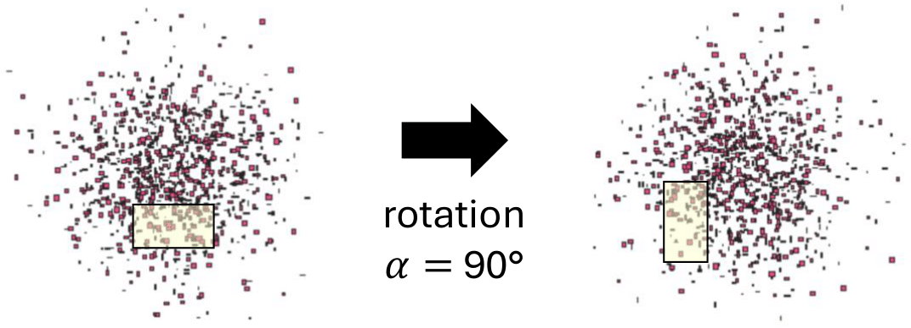
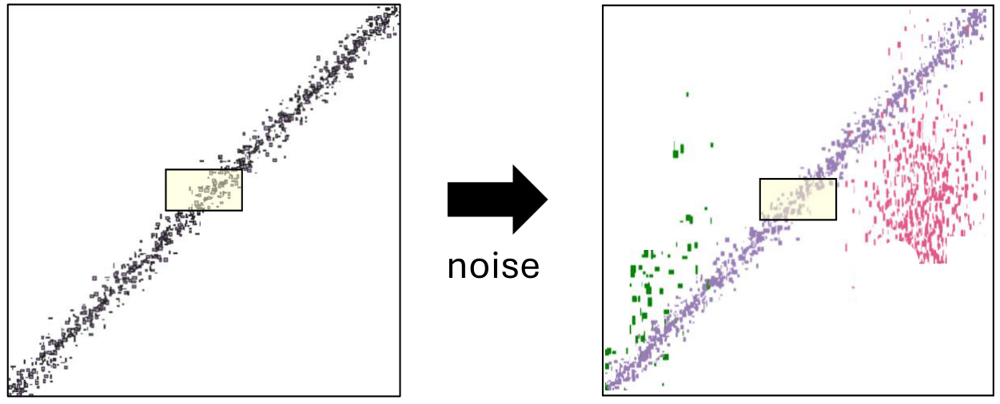
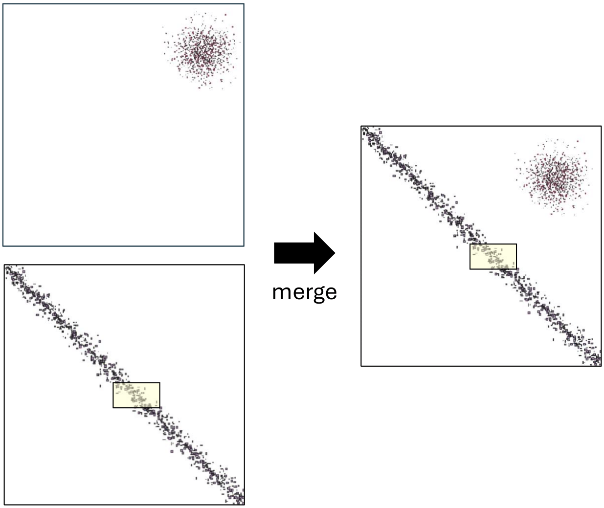

# Augmentation Techniques for Balancing Spatial Datasets

## Dataset generation

- **generator.sh**: bulk generation of synthetic spatial datasets by using the tool [SpiderWeb](https://spider.cs.ucr.edu/). The characteristics of the desired datasets are contained in CSV file like  *dataset-summaries.csv*.

## Dataset indexing

- **index.scala**: it computes the spatial index of the datasets in a specific directory by using the R*-Grove technique of [Beast](https://bitbucket.org/bdlabucr/beast/src/master/)

## Range query computation

- **range_query_v2.scala**: it computes the range query operation on a set of datasets and query windows specified in a CSV file like **

## Partitioning computation for balancing

- **rank_with_diff.py**: it computes the number of elements for each class of the defined partitioning

## Histograms computation

- **extract_histograms.py**: it computes the histograms of all the spatial datasets in a particular directory

## Fractal dimension computation

-

## Spatial augmentation

- **augmentation.py**: it performs the augumentation of spatial datasets by using the following techniques.

### Rotation 
Rotation of the dataset $D$ by an angle $\alpha$ around the centroid of the MBR of its reference space.

### Noise
Addition of new geometries or removal of existing ones inside the dataset without altering the ground truth value.

### Merge
Combination of two datastes without altering the ground truth value.

